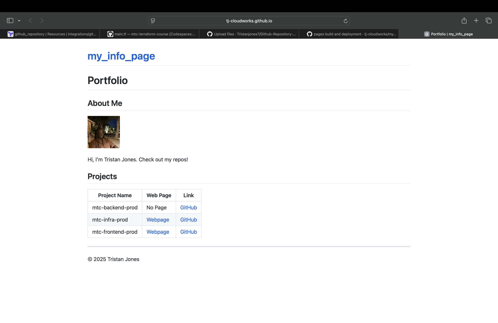
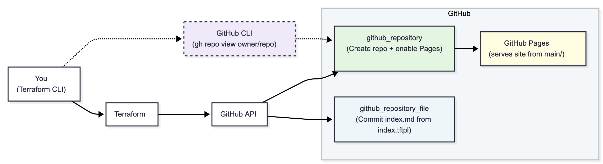

<div align="center">

# 🏗️ **GitHub Repository Factory (Terraform)**

<a href="https://www.terraform.io/"></a>
<a href="https://github.com/integrations/terraform-provider-github"></a>
<a href="https://pages.github.com/"></a>
<a href="https://developer.hashicorp.com/terraform/language/files/templatefile"></a>


<br/><br/>
**Create polished GitHub repositories with Pages and templated landing pages — all through Terraform.**
</div>

---

## 🚀 **Overview**

This project automates the creation of GitHub repositories using Terraform.  
Each repository is initialized, configured for **GitHub Pages**, and deployed with a ready-made **index.md** landing page that includes your name, avatar, and date — ensuring all projects look professional and consistent.

<p align="center"></p>

---

## 💡 **At a Glance**

- **Purpose:** Create and bootstrap GitHub repos under `Tristanjones7` with Pages enabled.  
- **Why it matters:** Consistent, documented repos make portfolios and collaboration more professional.  
- **Tech used:** Terraform, GitHub Provider v6, GitHub Pages, optional deploy keys.  
- **Scalable:** Supports single or multiple repos using `for_each`.  
- **Best practice:** No provider blocks inside child modules — keeps modularity clean and reliable.

---

## ⚙️ **How It Works**

1. **Create the repository** via Terraform (`github_repository`).  
2. **Enable GitHub Pages** with the `pages` block.  
3. **Render a Markdown landing page** using `templatefile()` and commit it via `github_repository_file`.  
4. **Open the repo** automatically in your browser using the GitHub CLI (with a short wait for propagation).  

✅ **Result:** A live, polished repository — automatically deployed and ready to share.

---

## 🧱 **Architecture**

<p align="center"></p>

| Resource | Purpose |
|-----------|----------|
| **github_repository** | Creates and configures the repo (visibility, Pages). |
| **github_repository_file** | Commits `index.md` generated from template. |
| **data.github_user** | Fetches avatar and metadata. |
| **time_static** | Sets a fixed year for the footer (prevents drift). |

---

## 🔧 **Setup**

### **Prerequisites**
- Terraform `~> 6.0`
- GitHub Personal Access Token (repo scope)
  ```bash
  export TF_VAR_github_token=<your_token>
(Optional) GitHub CLI (gh) configured locally
Repo Structure
/
├─ main.tf
└─ templates/
   └─ index.tftpl
Provider Configuration
provider "github" {
  token = var.github_token
  owner = "Tristanjones7"
}
🧩 Usage
Create a Single Repo
terraform {
  required_providers {
    github = { source = "integrations/github", version = "~> 6.0" }
    time   = { source = "hashicorp/time", version = "~> 0.11" }
  }
}

variable "github_token" { type = string, sensitive = true }

provider "github" {
  token = var.github_token
  owner = "Tristanjones7"
}

resource "github_repository" "this" {
  name        = "my_info_page"
  description = "Repository information for project"
  visibility  = "public"
  auto_init   = true

  pages { source { branch = "main" path = "/" } }

  provisioner "local-exec" {
    command = <<EOT
sleep 8
gh repo view ${self.full_name} --web 2>/dev/null || \
echo "✅ Repository created: https://github.com/${self.full_name}"
EOT
  }
}
Template Rendering
data "github_user" "owner" { username = "Tristanjones7" }
resource "time_static" "now" {}

locals {
  year = formatdate("YYYY", time_static.now.rfc3339)
}

resource "github_repository_file" "index" {
  repository          = github_repository.this.name
  branch              = "main"
  file                = "index.md"
  overwrite_on_create = true
  commit_message      = "Update index.md from Terraform template"

  content = templatefile("${path.module}/templates/index.tftpl", {
    avatar = "${data.github_user.owner.avatar_url}&s=200"
    name   = "Tristan Jones"
    date   = local.year
  })
}
🧠 Template (index.tftpl)
<p align="center">
  
</p>

<h1 align="center">Tristan Jones</h1>
<p align="center"><em>Project Info Page</em></p>
<p align="center"><sub>Last updated: 2025</sub></p>

<hr/>

## 🚀 Projects

| Project Name | Web Page | Link |
|---------------|-----------|------|
| backend-prod | No Page | [GitHub](https://github.com/backend-prod) |
| infra-prod | [Webpage](https://.github.io/infra-prod/) | [GitHub](https://github.com/infra-prod) |
| frontend-prod | [Webpage](https://.github.io/frontend-prod/) | [GitHub](https://github.com/frontend-prod) |

<p align="center"><sub>© 2025 Tristan Jones</sub></p>
🧭 Commands
terraform init
terraform validate
terraform apply
Update only the page content
terraform plan  -target=github_repository_file.index
terraform apply -target=github_repository_file.index
📥 Inputs & Outputs
Inputs
Name	Description
github_token	Personal Access Token with repo scope
Derived
Owner set to Tristanjones7
Avatar pulled from data.github_user.owner.avatar_url
Year generated via time_static
Outputs
Commits a generated index.md
(Optional) Add outputs for repo_url or full_name if needed
🔒 Security Notes
Never commit your GitHub token — always pass via environment variables.
Treat deploy keys as sensitive credentials.
Defaults to public repos; switch to visibility = "private" if required.
🧰 Troubleshooting
Common Issue: “Could not resolve to a Repository…”
GitHub’s GraphQL can lag briefly after creation — a short sleep and direct URL fallback are included.
Owner Mismatch
If ownership or permissions change mid-project, ensure:

owner = "tj-cloudworks"
inside your provider block.
🛣️ Roadmap
Add labels, topics, and branch protection
Submodule for CI/CD deploy keys
Dynamic project table generation
CODEOWNERS and PR templates
Portfolio hub linking all live Pages sites
💬 Contact
GitHub: @Tristanjones7
LinkedIn: linkedin.com/in/tristanjones7
🧾 Notes for Reviewers
This project demonstrates:
✅ Practical Infrastructure-as-Code with Terraform
✅ Integration with GitHub APIs and Pages automation
✅ Clean modular patterns for scalability
✅ Focus on documentation and developer experience
<div align="center"> <sub>© 2025 Tristan Jones — Cloud / DevOps Engineer</sub> </div> ```
