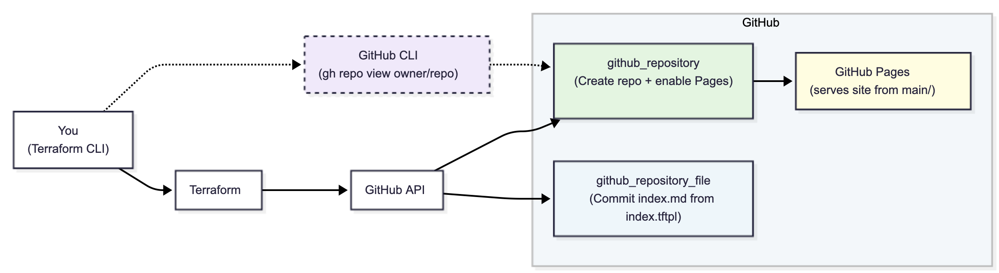

<div align="center">

# 🏗️ GitHub Repository Factory — Terraform

<a href="https://developer.hashicorp.com/terraform"></a>
<a href="https://github.com/integrations/terraform-provider-github"></a>
<a href="https://pages.github.com/"></a>
<a href="https://developer.hashicorp.com/terraform/language/functions/templatefile"></a>

**Provision and bootstrap a GitHub repository as code.**

</div>

---

## 🎯 What this project does

This project treats a GitHub repository as infrastructure.

Terraform creates and configures a repository, enables GitHub Pages, retrieves owner metadata, renders a reusable Markdown landing page with `templatefile()`, and commits that page into the new repository.

The result is a repeatable repository-bootstrap workflow that can be adapted for project templates, internal tooling, or portfolio repositories.

---

## 🏗️ Architecture

<p align="center">
  
</p>

```text
Terraform Configuration
        │
        ▼
GitHub Provider ──────────► GitHub API
        │                       │
        ▼                       ▼
Repository Configuration   Repository Creation
        │                       │
        └──────────┬────────────┘
                   ▼
          templatefile()
                   │
                   ▼
          Generated index.md
                   │
                   ▼
            GitHub Pages
```

### Core Terraform resources

| Resource | Purpose |
|---|---|
| `github_repository` | Creates and configures the repository |
| `github_repository_file` | Commits the generated landing page |
| `data.github_user` | Retrieves GitHub account metadata used by the template |
| `time_static` | Provides a stable generated year for the page |

---

## 🔄 How the factory works

1. Terraform initializes the required providers.
2. The GitHub provider authenticates using a token supplied through a sensitive variable.
3. `github_repository` creates the repository with the requested visibility and GitHub Pages configuration.
4. `data.github_user` retrieves the owner avatar URL.
5. `templatefile()` renders `templates/index.tftpl` using repository-specific values.
6. `github_repository_file` commits the generated `index.md` to the repository.
7. Terraform outputs the repository URL and expected Pages URL.

This turns a multi-step manual setup into a repeatable infrastructure workflow.

---

## 🧩 Repository structure

```text
Github-Repository-Factory-Terraform-/
├── main.tf
├── variables.tf
├── outputs.tf
├── terraform.tfvars.example
├── .gitignore
├── templates/
│   └── index.tftpl
├── architecture.png
├── apply.png
├── page-live.png
└── demo.mov
```

The screenshots and demo video provide evidence of the workflow and generated result, while the Terraform files contain the reusable implementation.

---

## ⚙️ Getting started

### Prerequisites

- Terraform 1.6+
- A GitHub Personal Access Token with the permissions required to create and modify repositories
- Optional: GitHub CLI (`gh`) if you want to inspect the generated repository from the command line

### 1. Configure authentication

Do **not** commit your GitHub token to the repository.

Set it as an environment variable instead:

```bash
export TF_VAR_github_token="<your-token>"
```

### 2. Configure variables

Copy the example file and edit the repository values:

```bash
cp terraform.tfvars.example terraform.tfvars
```

`terraform.tfvars` is ignored by Git.

### 3. Initialize Terraform

```bash
terraform init
```

### 4. Validate the configuration

```bash
terraform fmt -check
terraform validate
```

### 5. Review and apply

```bash
terraform plan
terraform apply
```

Terraform will create the repository, configure GitHub Pages, and commit the generated landing page.

---

## 📤 Outputs

After applying, Terraform returns:

- `repository_full_name` — owner/repository name
- `repository_url` — GitHub repository URL
- `pages_url` — expected GitHub Pages URL

These outputs make the result immediately usable by another automation step or workflow.

---

## 🔐 Security considerations

- GitHub credentials are passed through a **sensitive Terraform variable** rather than hard-coded.
- `terraform.tfvars` is excluded from Git so local credentials are not accidentally committed.
- Terraform state should be treated as sensitive because it can contain provider-managed resource information.
- Repository visibility is configurable rather than hard-coded to public.
- In a team environment, the token should be scoped to the minimum permissions required by the workflow.

> Never paste a real GitHub token into `terraform.tfvars` if that file could be committed or shared. Use environment variables or an appropriate secrets manager.

---

## 🧠 Engineering decisions

### Infrastructure as Code

Repository configuration is expressed declaratively, making the setup repeatable and version-controlled.

### Template-driven content

The landing page is separated from the Terraform resource definition. This keeps presentation logic in `templates/index.tftpl` instead of embedding a large Markdown document directly in `main.tf`.

### Provider configuration at the root

The GitHub provider is configured in the root module, keeping credentials and provider ownership centralized and leaving the implementation easier to extend into reusable modules later.

### Separation of inputs and outputs

Variables define what the factory needs; outputs expose the repository created by the factory. This makes the configuration easier to reuse in automation.

---

## 🚀 Possible next iteration

If I expanded this into a multi-repository platform, I would add:

- `for_each` support for creating multiple repositories from a map of definitions
- Standard repository topics and labels
- Branch protection and rulesets
- Issue and pull-request templates
- CODEOWNERS generation
- Standardized CI workflows
- Optional repository secrets and environments
- A portfolio hub that links generated repositories automatically

The current implementation intentionally focuses on the core repository-provisioning pattern first.

---

## 💼 Why this is relevant to platform engineering

Platform engineering is often about removing repetitive setup work and creating reliable paved paths for developers.

This project applies that idea to repository creation: define the desired configuration once, automate the setup, standardize the developer experience, and make the result repeatable.

---

## 👤 Author

**Tristan Jones**  
Cloud Platform Engineer  
AWS Certified Solutions Architect – Associate  
AWS Certified SysOps Administrator – Associate
